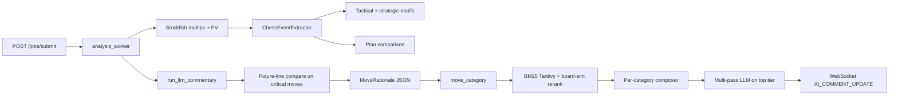
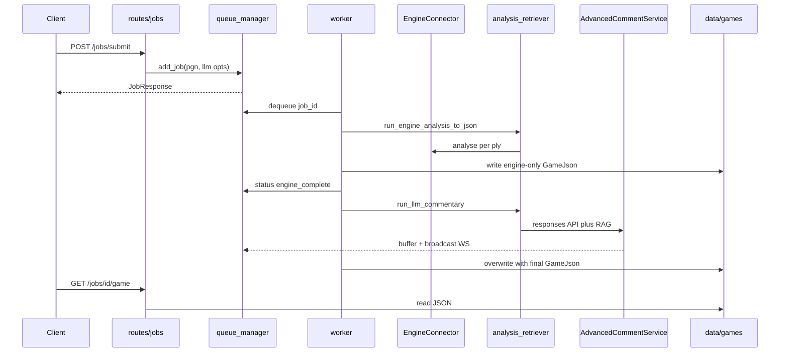
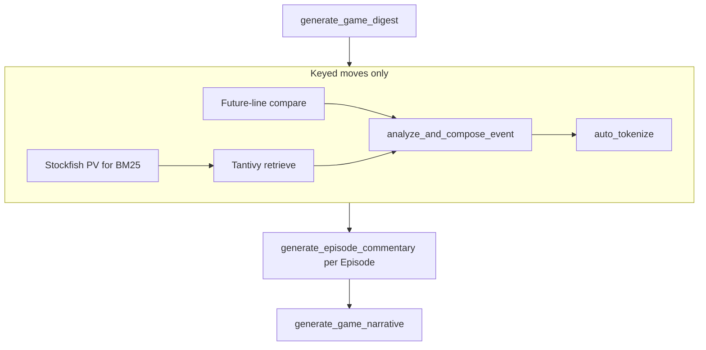

# Automatic chess annotator (backend)

FastAPI service that analyzes a PGN with Stockfish, detects key moments, runs **BM25 (Tantivy)** retrieval over a local positional index, and generates concise LLM commentary. Results stream over the **jobs** WebSocket.

## Requirements

- Python 3.10+
- `stockfish.exe` in the project root (Windows) or `STOCKFISH_PATH` pointing at the binary
- OpenAI API key for commentary

## Setup

```bash
python -m venv chess_v3.10
.\chess_v3.10\Scripts\activate.bat   # Windows
pip install -r requirements.txt
```

## Environment

| Variable | Purpose |
| -------- | ------- |
| `OPENAI_API_KEY` | Required for LLM commentary |
| `RAG_BM25_PATH` | Directory of the committed Tantivy BM25 index (e.g. `data/bm25_positions`). If unset or invalid, commentary runs without reference examples |
| `RAG_BM25_STOCKFISH_DEPTH` | Depth for runtime PV used in BM25 queries (default `14`) |
| `LLM_DEFAULT_MODEL` / `LLM_DEFAULT_EFFORT` | Optional overrides used by the analysis worker. Default model is `gpt-5.4` when unset; use `gpt-5.4-mini` for a cheaper near-frontier option (same as the UI). |
| `LOG_LLM_PROMPTS` | Set to `1` or `true` to log full user/system prompts for each LLM pass (server `logger.info`; dev only) |

## Run

```bash
uvicorn app.main:app --reload
```

## API (jobs pipeline)

- `POST /jobs/submit` — submit PGN; returns `job_id`
- `GET /jobs/{job_id}/status` — job status
- `GET /jobs/{job_id}/game` — finished `GameJson` when ready
- `WebSocket /jobs/{job_id}/ws` — commentary and narrative updates

The legacy `/evaluator/*` interactive session API has been removed; use the jobs flow above.

## Architecture (pipeline)



### Commentary pipeline (LLM)

1. **Engine + events** — `analyze_move` depth sweep (8/12/16), instability, PVs, motifs, `PlanComparison`, `move_category`.
2. **Critical moves** — optional dual `analyse` for **future-line delta** (played vs best PV leaves).
3. **RAG** — BM25 over positional tokens + **king_placement / imbalance** fields (encoder v2); **rerank** with `0.7*BM25_norm + 0.3*board_sim` (material, kings, pawn skeleton, piece map, ECO match; ECO gated in endgame).
4. **Prompting** — `MoveRationale` JSON + engine block; **per-category** system prompts (`tactical`, `positional`, `defensive`, …).
5. **Multi-pass (top tier: brilliant / blunder / critical_decision)** — motif JSON → reasoning JSON → segment composer (with token-budget warning if total usage > 4k).  
   Lower tiers: narrator → composer (2 steps) or single composer.

## BM25 index

Build or refresh the Tantivy corpus from **annotated** PGNs (local one-off). **Rebuild after encoder changes** (`encoder_version` in `positional_tokens.py`):

```bash
python scripts/build_bm25_corpus.py --help
```

**Strict annotated mode (default):** each indexed position must have a non-junk `{...}` comment within the next `--max-annotation-delta` half-moves (default **4**). Positions with no such comment are **skipped** (smaller index than PV-only builds). Junk is filtered the same way as in `app/core/commentary/annotation_corpus.py` (too short, NAG-only, etc.).

Stored fields per row include `annotation_text`, `annotation_ply`, and `plies_to_next_annotation`. At query time, [`TantivyPositionalRetriever`](app/core/commentary/tantivy_positional_retriever.py) prefers the master comment for RAG text and applies a `1/(1+Δ)` boost; if the comment refers to a position a few plies ahead, the UI may show the prefix `(annotation +N plies)`.

See `data/bm25_positions/README.md` for index layout. `metadata.json` records `annotated_only`, `annotated_rows`, and `max_annotation_delta` after each build.

## Debugging RAG + prompts

**CLI — sample or query the BM25 index** (from repo root, with venv activated):

```bash
python scripts/random_rag_hits.py --count 5
python scripts/random_rag_hits.py --path data/bm25_positions --count 3
python scripts/random_rag_hits.py --query-fen "<FEN>" --pv-san "e5 Nf3 Nc6" --eco B12 --phase middlegame --ply 10 --top-k 5
```

Mode A prints random stored rows (source, game id, ECO, plies, FEN, PV SAN, annotation text). Mode B runs `TantivyPositionalRetriever.retrieve` and prints the same text the LLM sees (master comment or `PV:` fallback), score, and relevance tags.

**Server logs** — set `LOG_LLM_PROMPTS=1` to print the assembled event user blob (`build_event_input`) and each composer / JSON-schema pass with full system + user text.

**Frontend** — each streamed `AI_COMMENT_UPDATE` includes `data.llm_debug` (RAG query, rationale, planned system prompts, full user text, passes, token totals). The web UI shows a collapsible **LLM debug** block under the active commentary card (below RAG chips) and logs the same payload to the browser console under `[LLM debug]`.

## Data flow

The backend is built around a single **jobs pipeline**: one HTTP submission creates one asynchronous job, one worker consumes it, and the same job id keys both the on-disk artifact and the commentary WebSocket. That design keeps the mental model simple: the client always correlates progress, streamed commentary, and the final JSON with one identifier.

Submission begins when the client posts a PGN to [`POST /jobs/submit`](app/routes/jobs.py). The route validates that the string contains exactly one game via [`PGNReader.validate_single_game`](app/core/io/pgn_reader.py), then calls [`queue_manager.add_job`](app/core/queue_manager.py). The queue manager assigns a UUID, stores the PGN plus optional `llm_model` / `llm_effort`, enqueues the id on an asyncio queue, and records status `waiting`. The HTTP response is immediate; no analysis runs in the request thread.

The long-running work happens in [`analysis_worker`](app/core/worker.py), started from the FastAPI lifespan in [`app/main.py`](app/main.py). The worker dequeues a job id, loads job data, and sets status to `processing`. It then invokes [`run_engine_analysis_to_json`](app/core/engine/analysis_retriever.py), which parses the PGN, runs Stockfish-backed move analysis through [`EngineConnector`](app/core/engine/engine_connector.py), derives structured events and episodes (see **Modules** below), and returns an [`EnginePipelineState`](app/core/engine/analysis_retriever.py) together with enough material to build a [`GameJson`](app/models/GameJson.py). The worker writes that JSON to `data/games/{job_id}.json`—first **without** LLM fields—and advances status to `engine_complete`. That intermediate write lets a client or operator inspect engine output even if commentary fails.

Commentary is a second phase: [`run_llm_commentary`](app/core/engine/analysis_retriever.py) mutates the same `EnginePipelineState`, calling [`AdvancedCommentService`](app/core/commentary/advanced_comment_service.py) for digests, move prose, episode text, and a closing game narrative. Optional callbacks push WebSocket messages (see **LLM interactions**). When commentary finishes, the worker calls [`assemble_game_json`](app/core/engine/analysis_retriever.py) again and **overwrites** the same file with the enriched payload, clears the per-job commentary buffer, and sets status `completed`. Failures anywhere in the pipeline call [`mark_failed`](app/core/queue_manager.py) on the queue manager.

Real-time updates use [`WebSocket /jobs/{job_id}/ws`](app/routes/jobs.py). On connect, the server replays buffered messages so late subscribers do not miss earlier commentary. The worker’s `commentary_callback` both buffers and broadcasts via [`broadcast_to_job_ws`](app/core/queue_manager.py). Completed results are fetched with [`GET /jobs/{job_id}/game`](app/routes/jobs.py), which reads `data/games/{job_id}.json` when present. Separately, [`cleanup_old_files`](app/core/cleanup.py) runs in the background from the app lifespan and deletes stale files under `data/games` to bound disk use.



## Modules

The codebase layers naturally from HTTP into orchestration, engine I/O, semantic extraction, retrieval, and language generation. The table below groups files by responsibility; follow the links when you need implementation detail.

| Layer | Role | Primary files |
| ----- | ---- | ------------- |
| API | FastAPI app, CORS, lifespan, health | [`app/main.py`](app/main.py) |
| HTTP + WebSocket | Job submit, status, game download, commentary socket | [`app/routes/jobs.py`](app/routes/jobs.py) |
| Queue + jobs | In-memory jobs, asyncio queue, WS fan-out, commentary replay | [`app/core/queue_manager.py`](app/core/queue_manager.py) |
| Worker | Dequeue loop, two-phase pipeline, file writes, status transitions | [`app/core/worker.py`](app/core/worker.py) |
| Retention | Periodic deletion of old game JSON | [`app/core/cleanup.py`](app/core/cleanup.py) |
| Engine | Stockfish subprocess via python-chess UCI | [`app/core/engine/engine_connector.py`](app/core/engine/engine_connector.py) |
| Pipeline | PGN → per-move analysis → events → episodes → `GameJson`; engine and LLM entry points | [`app/core/engine/analysis_retriever.py`](app/core/engine/analysis_retriever.py) |
| PGN I/O | Validate and read a single game from a string | [`app/core/io/pgn_reader.py`](app/core/io/pgn_reader.py) |
| Events | From analyzed rows to `MoveEvent` (motifs, plans, ECO, key moments) | [`app/core/commentary/event_extractor.py`](app/core/commentary/event_extractor.py) |
| Episodes | Segment event streams into narrative chunks | [`app/core/commentary/episode_segmenter.py`](app/core/commentary/episode_segmenter.py) |
| Key moments | Heuristic labels that gate LLM move commentary | [`app/core/commentary/key_moment_detector.py`](app/core/commentary/key_moment_detector.py) |
| Rationale | Deterministic JSON summarizing a move for prompts | [`app/core/commentary/move_rationale.py`](app/core/commentary/move_rationale.py) |
| Features | Classification, motifs, plan comparison, future-line compare, positional features and token encoders | [`app/core/commentary/features/`](app/core/commentary/features) |
| Openings | ECO lookup from bundled JSON | [`app/core/commentary/openings/eco_book.py`](app/core/commentary/openings/eco_book.py) |
| RAG | Query model and default retriever wiring | [`app/core/commentary/rag_retriever.py`](app/core/commentary/rag_retriever.py), [`app/core/commentary/tantivy_positional_retriever.py`](app/core/commentary/tantivy_positional_retriever.py) |
| Corpus helpers | Offline PGN comment filtering (index build scripts; not on the hot path) | [`app/core/commentary/annotation_corpus.py`](app/core/commentary/annotation_corpus.py) |
| LLM + tokens | OpenAI Responses API, prompts, post-processing into `[type:content]` tokens | [`app/core/commentary/advanced_comment_service.py`](app/core/commentary/advanced_comment_service.py), [`app/core/commentary/annotation_tokens.py`](app/core/commentary/annotation_tokens.py) |
| Models | API and domain types | [`app/models/GameJson.py`](app/models/GameJson.py), [`app/models/job.py`](app/models/job.py), [`app/models/Move.py`](app/models/Move.py), [`app/models/PgnMetadata.py`](app/models/PgnMetadata.py), [`app/models/chess_events.py`](app/models/chess_events.py) |
| Config | Small static `Settings` holder | [`app/config/settings.py`](app/config/settings.py) |
| Env bootstrap | Optional `dotenv`, exposes `OPENAI_API_KEY` | [`app/core/__init__.py`](app/core/__init__.py) |

[`app/core/annotator.py`](app/core/annotator.py) is a legacy helper that annotates a python-chess `Game` with pipe-separated comments; it is **not** imported by the current jobs pipeline. The authoritative artifact is always the `GameJson` produced by `analysis_retriever` and persisted by the worker.

## LLM interactions

All generative language in this service goes through **one module**: [`AdvancedCommentService`](app/core/commentary/advanced_comment_service.py). It constructs prompts, calls **`AsyncOpenAI().responses.create`** (OpenAI’s **Responses** API, not Chat Completions), and parses structured outputs where JSON schemas are attached. There is no second LLM SDK in `app/`. Environment variables for models, logging, and RAG paths are summarized in **Environment** above; additionally, the commentary stage respects **`FUTURE_LINE_DEPTH`** and **`FUTURE_LINE_PLIES`** when comparing played lines to the engine’s best continuation (see [`future_line_compare.py`](app/core/commentary/features/future_line_compare.py)).

Orchestration lives in [`run_llm_commentary`](app/core/engine/analysis_retriever.py). Conceptually it runs four **language** passes over the same `GameAnalysisContext` carried in `EnginePipelineState`, interleaved with **non-LLM** Stockfish calls that only exist to sharpen retrieval and rationale (principal variation for BM25, future-line deltas on critical positions).

First, **`generate_game_digest`** asks the model for a compact structured summary of the whole game. The digest is stored on the context and, when a `commentary_callback` is provided, emitted to clients as **`GAME_SUMMARY`**. Second, for moves that carry a **`key_moment_type`** (not every ply), the pipeline may refresh engine-backed fields—PV SAN aligned with the corpus query, and optionally a **`FutureLineDelta`** when the played move diverges from the engine’s preference—then **`analyze_and_compose_event`** runs. That method is tiered: the highest-severity moments (e.g. brilliant, blunder, critical decision) use a **three-step** chain (motif synthesis JSON → reasoning JSON → segment composer); lighter moments use two steps (position narrator JSON → composer) or a **single** composer pass. Retrieved examples from the Tantivy index are injected before the composer. The final move string is passed through **`auto_tokenize`** in [`annotation_tokens.py`](app/core/commentary/annotation_tokens.py) so the UI can resolve typed tokens. Each completed move commentary is sent as **`AI_COMMENT_UPDATE`**, including **`llm_debug`** for transparency.

Third, **`generate_episode_commentary`** runs once per [`Episode`](app/models/chess_events.py) after move-level commentary, producing **`EPISODE_NARRATIVE`** messages. Fourth, **`generate_game_narrative`** synthesizes a single closing story from the episode summaries, yielding **`GAME_NARRATIVE`**. Together, digest → keyed moves → episodes → game narrative gives the thesis-friendly story arc: global orientation, local highlights, meso-structure, and closure.

Retrieval is **lexical**, not embedding-based. [`build_rag_query`](app/core/commentary/rag_retriever.py) packs FEN, PV SAN, ECO, phase, motifs, and theme hints into a [`RAGQuery`](app/core/commentary/rag_retriever.py). [`get_default_retriever`](app/core/commentary/tantivy_positional_retriever.py) opens a Tantivy index at **`RAG_BM25_PATH`** or returns a no-op retriever if the path is missing. Ranking blends normalized BM25 with board-structure similarity and boosts examples whose master annotation is closer in plies (see **Architecture** and **BM25 index** for the scoring intuition). If **`OPENAI_API_KEY`** is absent, commentary degrades gracefully: digests may be empty and move commentary falls back to a fixed disabled message, while engine analysis still completes.



## Tests

```bash
python -m unittest discover -s tests -v
```
