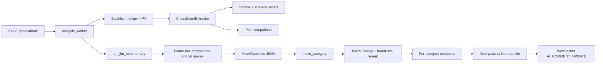

# Automatic chess annotator (backend)

FastAPI service that analyzes a PGN with Stockfish, detects key moments, runs **BM25 (Tantivy)** retrieval over a local positional index, and generates concise LLM commentary. Results stream over the **jobs** WebSocket.

## Requirements

- Python 3.10+
- `stockfish.exe` in the project root (Windows) or `STOCKFISH_PATH` pointing at the binary
- OpenAI API key for commentary

## Setup

```bash
python -m venv chess_v3.10
.\chess_v3.10\Scripts\activate.bat   # Windows
pip install -r requirements.txt
```

## Environment

| Variable | Purpose |
| -------- | ------- |
| `OPENAI_API_KEY` | Required for LLM commentary |
| `RAG_BM25_PATH` | Directory of the committed Tantivy BM25 index (e.g. `data/bm25_positions`). If unset or invalid, commentary runs without reference examples |
| `RAG_BM25_STOCKFISH_DEPTH` | Depth for runtime PV used in BM25 queries (default `14`) |
| `LLM_DEFAULT_MODEL` / `LLM_DEFAULT_EFFORT` | Optional overrides used by the analysis worker. Default model is `gpt-5.4` when unset; use `gpt-5.4-mini` for a cheaper near-frontier option (same as the UI). |
| `LOG_LLM_PROMPTS` | Set to `1` or `true` to log full user/system prompts for each LLM pass (server `logger.info`; dev only) |

## Run

```bash
uvicorn app.main:app --reload
```

## API (jobs pipeline)

- `POST /jobs/submit` — submit PGN; returns `job_id`
- `GET /jobs/{job_id}/status` — job status
- `GET /jobs/{job_id}/game` — finished `GameJson` when ready
- `WebSocket /jobs/{job_id}/ws` — commentary and narrative updates

The legacy `/evaluator/*` interactive session API has been removed; use the jobs flow above.

## Architecture (pipeline)



### Commentary pipeline (LLM)

1. **Engine + events** — `analyze_move` depth sweep (8/12/16), instability, PVs, motifs, `PlanComparison`, `move_category`.
2. **Critical moves** — optional dual `analyse` for **future-line delta** (played vs best PV leaves).
3. **RAG** — BM25 over positional tokens + **king_placement / imbalance** fields (encoder v2); **rerank** with `0.7*BM25_norm + 0.3*board_sim` (material, kings, pawn skeleton, piece map, ECO match; ECO gated in endgame).
4. **Prompting** — `MoveRationale` JSON + engine block; **per-category** system prompts (`tactical`, `positional`, `defensive`, …).
5. **Multi-pass (top tier: brilliant / blunder / critical_decision)** — motif JSON → reasoning JSON → segment composer (with token-budget warning if total usage > 4k).  
   Lower tiers: narrator → composer (2 steps) or single composer.

## BM25 index

Build or refresh the Tantivy corpus from **annotated** PGNs (local one-off). **Rebuild after encoder changes** (`encoder_version` in `positional_tokens.py`):

```bash
python scripts/build_bm25_corpus.py --help
```

**Strict annotated mode (default):** each indexed position must have a non-junk `{...}` comment within the next `--max-annotation-delta` half-moves (default **4**). Positions with no such comment are **skipped** (smaller index than PV-only builds). Junk is filtered the same way as in `app/core/commentary/annotation_corpus.py` (too short, NAG-only, etc.).

Stored fields per row include `annotation_text`, `annotation_ply`, and `plies_to_next_annotation`. At query time, [`TantivyPositionalRetriever`](app/core/commentary/tantivy_positional_retriever.py) prefers the master comment for RAG text and applies a `1/(1+Δ)` boost; if the comment refers to a position a few plies ahead, the UI may show the prefix `(annotation +N plies)`.

See `data/bm25_positions/README.md` for index layout. `metadata.json` records `annotated_only`, `annotated_rows`, and `max_annotation_delta` after each build.

## Debugging RAG + prompts

**CLI — sample or query the BM25 index** (from repo root, with venv activated):

```bash
python scripts/random_rag_hits.py --count 5
python scripts/random_rag_hits.py --path data/bm25_positions --count 3
python scripts/random_rag_hits.py --query-fen "<FEN>" --pv-san "e5 Nf3 Nc6" --eco B12 --phase middlegame --ply 10 --top-k 5
```

Mode A prints random stored rows (source, game id, ECO, plies, FEN, PV SAN, annotation text). Mode B runs `TantivyPositionalRetriever.retrieve` and prints the same text the LLM sees (master comment or `PV:` fallback), score, and relevance tags.

**Server logs** — set `LOG_LLM_PROMPTS=1` to print the assembled event user blob (`build_event_input`) and each composer / JSON-schema pass with full system + user text.

**Frontend** — each streamed `AI_COMMENT_UPDATE` includes `data.llm_debug` (RAG query, rationale, planned system prompts, full user text, passes, token totals). The web UI shows a collapsible **LLM debug** block under the active commentary card (below RAG chips) and logs the same payload to the browser console under `[LLM debug]`.

## Tests

```bash
python -m unittest discover -s tests -v
```
